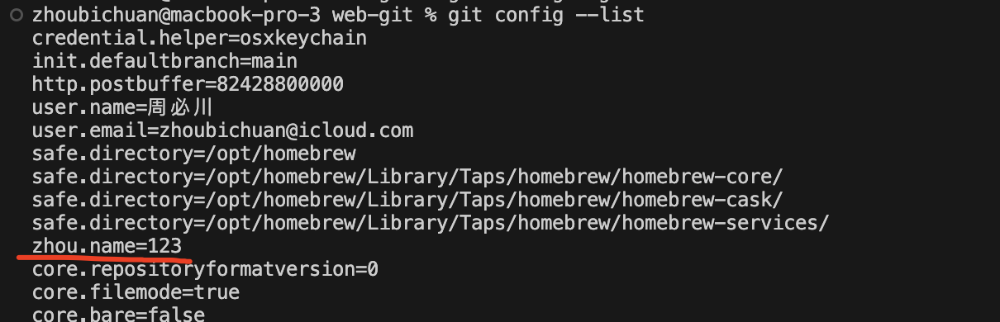
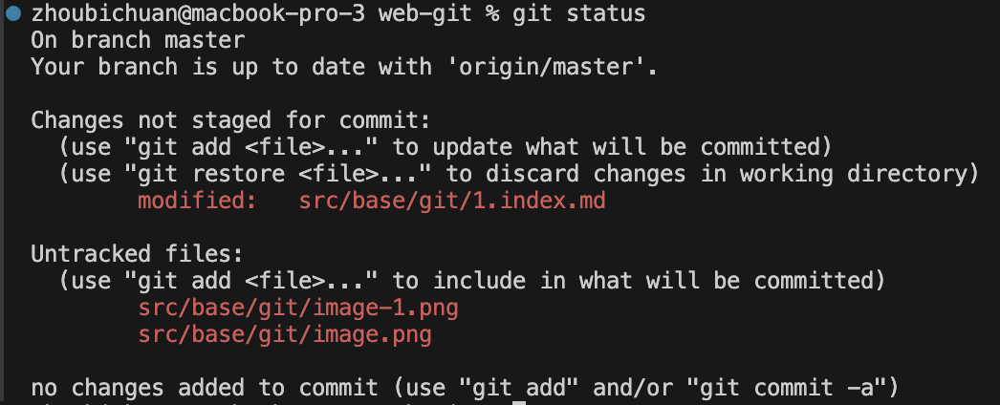

# 一.基础认识


::: tip 前言
git 是一个分布式的版本控制软件，git 的作用是管理代码，git 的特点：
:::

## 1.配置

- 增加配置列表

  ```sh
  git config --global zhou.name '123'
  ```

- 改配置列表

  ```sh
  git config --global --replace-all user.email "输入你的邮箱"
  git config --global --replace-all user.name "输入你的用户名"
  ```

- 删配置列表

  ```sh
  git config --global --unset zhou.name
  ```

- 查看配置列表

  ```sh
  git config --list
  git config -l # 简写
  ```

  

## 2.提交流程

工作区->暂存区->历史区->远程仓库 --这里默认为主分支

### 2.1 工作区-->暂存区

- 初始化本地仓库（第一次提交要初始化本地仓库）

  ```sh
  git init
  ```

- 将工作区修改的内容添加到暂存区

  ```sh
  git add [文件名称] # 单个文件
  git add . # 整个目录
  git add * # 所有文件
  ```

### 2.2 暂存区-->历史区

- 将暂存区中修改的内容提交到历史区

  ```sh
  git commit [文件名称] -m '提交的注释' # 单个文件提交
  git commit -m '提交注释' # 全部文件提交
  ```

- 没有添加 -m
  - i 进入编辑模式
  - :wq 保存并退出
  - ：ql！ 退出

### 2.3 操作

- 创建文件

  ```sh
  touch [文件名称]
  ```

- 查看工作区和暂存区那些文件修改（红色），查看暂存区和历史区那些文件修改（绿色）

  ```sh
  git status -s
  ```

  

  ```sh
  git status
  ```

  

- 查看工作区和暂存区内容差异

```sh
git diff
```


- 查看工作区和历史区内容差异

```sh
git diff --cached
```

- 查看历史区历史记录（如提交远程仓库记录）

```sh
git log
```


```sh
git log --oneline
```


- 前看看是否有分支

```sh
git branch
```

## 3.代码回退

### 3.1 git 没有关闭

- 回退所有区域（历史区、暂存区、工作区）

```sh
git reset --hard
```

- 回退历史区和暂存区

```sh
git reset --mixed
```

- 回退历史区

```sh
git reset --soft
```

### 3.2 git 关闭后

- 查看历史区版本号

```sh
git reflog
```

- 把历史区重置到

```sh
git reset --hard HEAD^ #  上一个提交
git reset --hard HEAD^^ # 上上个提交
git reset --hard HEAD@{编号} #  指定编号
```

- 把历史区重置到指定版本

```sh
git reset --hard [编号]
```

- 用历史区的内容覆盖暂存区的内容

```sh
git reset HEAD --[文件名称] 
git reset HEAD -- .
```

- 用暂存区的内容覆盖本地工作区的内容

```sh
git checkout -- [文件名称] # 单个文件
git checkout -- . # 所有文件
```

## 4.分支提交

- 有多个分支的情况：bug 分支、需求分支

- 查看分支

```sh
git branch
```

- 创建分支

```sh
git branch [分支名称]
```

- 切换分支

```sh
git checkout [分支名称]
```

- 合并分支（master 分支没有改动）

```sh
git merge [分支名称]
```

- 删除分支

```sh
git branch -d [分支名称]
```

- 创建分支并切换分支

```sh
git checkout -b [切换的分支名称]
```

- 合并分支（master 分支有更改，和现有的分支冲突）

```sh
git merge [分支] # 出现冲突，代码中去解决冲突
git commit -m '分支合并'
```

- 分支提交日志

```sh
git log --graph --oneline
```

## 5.暂存工作内容

- 需求任务开发到一半，临时有一个紧急 bug 需要修复

- 把当前的工作区和暂存区保存到一个地方，并且用最新的历史区覆盖当前的工作区和暂存区

```sh
git stash
```

- 创建 bug 分支改 bug，提交后切换 master 分支合并

```sh
git merge bug
```

- 列出所有的储存区

```sh
git stash list
```

- 应用不删除

```sh
git stash apply
```

- 删除

```sh
git stash drop
```

- 应用删除

```sh
git stash pop
```

## 6.报错

- 提交远程仓库报错

  ```sh
  fatal: remote origin already exists.
  ```

  - 解决方法：删除历史区重新提交

- ssh 使用公钥授权不通过的问题解决
  - 用命令行 push 提交直接输入密码
