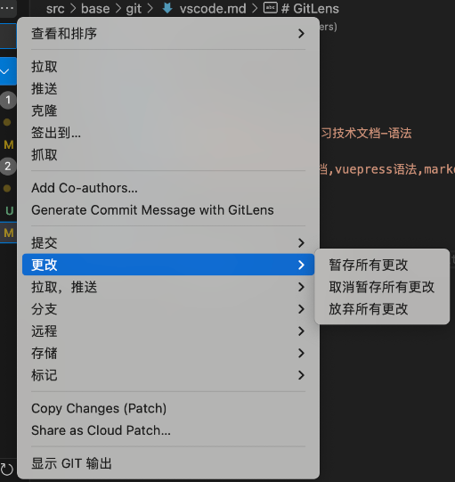
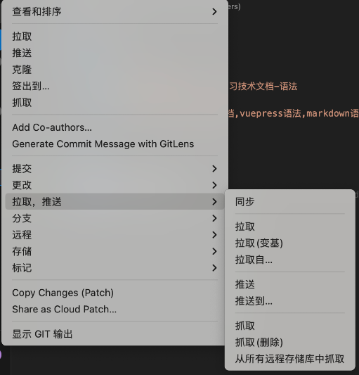

# 一.GitLens

## 1.提交

> 提交`dev`远程`dev`无修改（个人项目）：

提交 --> 推送

> 提交`dev`远程`dev`有修改（多人开发）：

提交 -->  推送  --> 冲突 --> 解决冲突 --> 合并冲突 --> 推送

## 2.更改

## 3.1 拉取

> 提交`dev`远程`dev`有修改：

提交 -->  推送  --> 冲突 --> 拉取（变基） --> 解决冲突 --> 提交 --> 推送

> 提交`dev`远程`dev`有修改，远程`master`有修改：

提交 -->  推送  --> 冲突 --> 拉取（变基） --> 解决冲突 --> 拉取自`master` --> 冲突 --> 解决冲突--> 合并冲突 --> 推送

## 3.2 推送

> `feature` 代码合并到 `dev` 、`master`上:

切换到`feature`分支 --> 拉取自`master` --> 拉取自`dev` --> 推送到`master` --> 推送到`dev`

## 4.分支

> `dev` 合并到`master`:

切换到 `master` --> 合并（选择`dev`）

- 备份现有未提交代码：创建 `back_code` 分支

## 5.远程

## 6.存储

> 提交`dev`远程`dev`有修改：

储藏（包含未跟踪） -->  拉取  --> 应用最新储藏 -->  冲突 --> 解决冲突 --> 提交 --> 推送

## 7.标记

-

## 8.其他

> 撤销提交

`Undo Commit`

> 反向提交（有提交记录）

`Revert Commit`

> 删除提交

`Reset Commit`

- 参考

